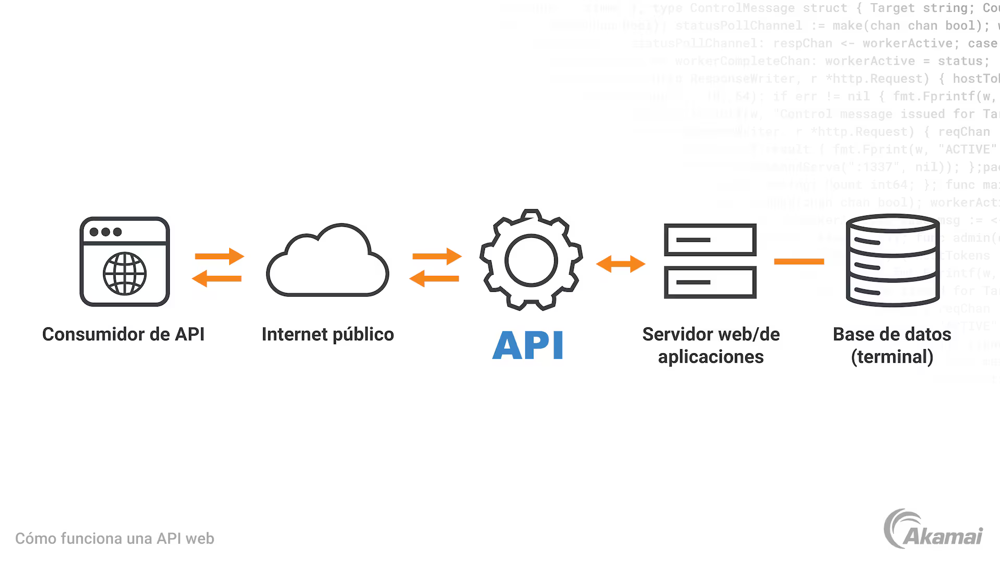

# CheckPoint 6

<br>  

1.  ***¿Para qué usamos Clases en Python?***

  <br>  
    
  En Python, las clases y los objetos trabajan juntos para organizar y gestionar datos. Se crea una clase para definir comportamientos compartidos, después se crean objetos que usen esos comportamientos.
<br>

En otras palabras, una clase es como un plano o plantilla que se utiliza para crear objetos.
<br>

Pero vayamos por partes...  
 En primer lugar veamos qué son las clases y cómo usarlas para crear objetos.
<br>

Una clase es un contenedor, el cual alberga datos y funciones que definirá el comportamiento de los objetos que se creen.
<br>

Para crear una clase se usa la palabra clave `class`  seguida del nombre de la clase y dos puntos (`:`).   
Después, dentro de la clase, se puede añadir un inicializador además de cualquier atributo y método.  
<br>  

Los atributos son como variables dentro de una clase y se usan para almacenar datos. Los métodos son funciones definidas dentro de una clase y son las acciones que pueden realizar los objetos creados con una clase .  
<br>  

A continuación se muestra la sintaxis básica de una clase:  

```python
 class NombreClase:
	 def __init__(self, nombre, edad):
	    self.nombre = nombre
	    self.edad = edad

	 def ejemplo_metodo(self):
			print(self.nombre.upper())
```				

* `class NombreClase` se compone de la palabra clave `class` para crear una clase, seguida del nombre de la clase, en este caso `NombreClase`.  
<br>  
Para los nombres de clase en Python (y en otros lenguajes) se suele usar la forma 'CamelCase', donde el nombre comienza en mayúsculas, y en caso de formarse con varias palabras se escriben todas capitalizadas y juntas (sin guiones bajos).  

<br>  

* `def __init__(self, nombre, edad)` es el método especial que es llamado automáticamente cuando se crea un nuevo objeto.  


	Inicializa los atributos de los objetos que serán creados con la clase.
	<br>  
	
* `self.nombre = nombre` y `self.edad = edad` son los atributos que van a tener los objetos.  
	<br>  
	
* `def ejemplo_metodo(self):` es el método que cada objeto creado puede llamar.  
	<br>  
	
* `print(self.nombre.upper())` es lo que hará el método `ejemplo_metodo`, en este caso, imprime nombre en mayúsculas.  
<br>  

Veámoslo ahora con un ejemplo y cómo se pueden crear objetos a partir de una clase:  

<div  style="text-align: center;">
	
</div>  
<br>  


```python
class Perro:
  def __init__(self, nombre, edad):
    self.nombre = nombre
    self.edad = edad

def ladrar(self):
		print(f'{self.nombre.upper()} dice ¡guau guau!')
```
<br>  

Con esta clase `Perro` vamos a crear objetos.  

Esta es la sintaxis básica para  crear objetos a partir de una clase:  

```python
objeto_1 = NombreClase(atributo_1, atributo_2)
objeto_2 = NombreClase(atributo_1, atributo_2)
```

<br>  

También se les puede llamar a cualquiera de los métodos definidos en la clase desde cada objeto:  

```python
    objeto_1.nombre_metodo()
    objeto_2.nombre_metodo()
```

<br>  

Ahora vamos con el ejemplo práctico.  

Crearemos dos 'perros' (objetos) usando la clase `Perro`  

```python
    class Perro:
		    def __init__(self, nombre, edad):
				    self.nombre = nombre
				    self.edad = edad

				def ladrar(self):
					print(f'{self.nombre.upper()} dice ¡guau guau, y tengo {self.edad} años!')
		
		
	# Inicializamos perro_1 y perro_2
	
	perro_1 = Perro('Yoshi', 3)
	perro_2 = Perro('Casper', 7)
	
	
	# Llamamos al metodo ladrar
	  
	perro_1.ladrar() # YOSHI dice ¡guau guau, y tengo 3 años!
	perro_2.ladrar() # CASPER dice ¡guau guau, y tengo 7 años!
```

Hemos creado `perro_1` y `perro_2` pasándoles 2 argumentos a cada uno, Yoshi y 3 al primero, y Casper y 7 al segundo; con lo que se establecen los atributos `nombre` y `edad` para estas instancias.

<br>  
Al llamar al método `ladrar()` podemos comprobar que las salidas son distintas aunque se hayan usando los mismos atributos `nombre` y `edad` en ambos casos.  

<br>  
Resumiendo:  

Una clase define qué datos y comportamiento debe tener un objeto, y este último contiene los datos reales y usa dicho comportamiento.  

La clase se escribe una vez, y se pueden crear muchos objetos a partir de ella, cada uno con datos diferentes.  

<br><br>

2.  ***¿Qué método se ejecuta automáticamente cuando se crea una instancia de una clase?***

  <br>
  
  Tal y como se mostró en el punto anterior
`__init__` es un método constructor al que se llama justo después de crearse un objeto (instancia) de una clase.  

 Su función principal es inicializar los atributos del objeto con los valores que se le pasen o con valores por defecto.  

Su sintaxis básica es:  

```python
    class MiClase:
    def __init__(self, parametros):
        # Inicialización de atributos
        self.atributo = valor
```

<br>  

Al asignar una clase a un objeto  

    objeto = MiClase(argumentos)
  
  <br>  
  
  Python crea el objeto y automáticamente llama al método `__init__` con los argumentos que se le haya pasado.  

Aquí tenemos un ejemplo:  

```python
    class Persona:
		    def __init__(self, nombre, edad):
		        self.nombre = nombre
		        self.edad = edad  
		        
	p = Persona("Ana", 30)  
	print(p.nombre)  # Salida: Ana  
	print(p.edad)    # Salida: 30
  ````
  
  <br>  
  
Además de eso, el primer parámetro de `__init__`  siempre es una referencia  al objeto específico que se está creando o usando. Por convención, este parámetro se llama `self`, pero técnicamente, puede usarse cualquier nombre. `self` permite acceder a los propios atributos y métodos del objeto.  

<br><br>

3.  ***¿Cuáles son los tres verbos de API?***

  <br>
  
  Antes de explicar los tres verbos de API, creo que es conveniente empezar indicando **qué es una API**:  

Una  **API**  o "Interfaz de Programación de Aplicaciones"  por sus siglas en inglés, es un conjunto de reglas que permite que dos programas o sistemas diferentes se comuniquen entre sí.

<div  style="text-align: center;">
	
</div>  
<br>  


Lo mejor para entenderlo va a ser utilizar un símil.

Haciendo un alarde de imaginación vamos a transformar el servidor al que queremos acceder en un restaurante.

Nada más entrar nos atiende un camarero muy amable, que en nuestro caso sería la API.  

Nosotros le decimos qué queremos pedir (hacemos una solicitud); entonces el camarero entra en la cocina (el sistema o servidor) con nuestro pedido, y vuelve con la comida (la respuesta).  

Nosotros no necesitamos saber cómo se elabora la comida, tan sólo saber cómo pedirla.

En el mundo digital, las APIs permiten que aplicaciones, sitios web o dispositivos intercambien información y realicen acciones sin que el usuario tenga que intervenir directamente en el proceso.  
<br>   
Una vez dicho esto comencemos por saber qué son los verbos de una API:  

Si hablamos de APIs, especialmente las que usan el estilo REST (muy comunes en la web), se utilizan **verbos HTTP** para indicar qué acción queremos hacer con un recurso (un dato o conjunto de datos).  

Los tres verbos principales son:  

	    - GET  
	    - POST  
	    - PUT  
	    
<br>  
Para los ejemplos vamos a usar una biblioteca ficticia y cuya API tiene los siguientes endpoints para los libros:  

		GET /libros      -> lista todos los libros  
		GET /libros/{id} -> obtiene un libro po ID  
		POST /libros     -> crea un libro nuevo  
		PUT /libros/{id} -> actualiza un libro por ID  

<br>  

 * **GET (Obtener)**  
 
 <br>  
 
|¿Qué hace?|Ejemplo sencillos |En términos API|
|--|--|--|
| Pide información o datos de un recurso | Queremos ver una lista de libros en una biblioteca| Se solicita los datos de los libros para que los muestre |  

<br>  
Supongamos que queremos obtener una lista de libros.
  
<br> 

```python
    import requests

	url = "https://api.biblioteca.com/libros"
	response = requests.get(url)

	if response.status_code == 200:
	    libros = response.json()
	    print("Lista de libros:")
	    for libro in libros:
	        print(f"- {libro['titulo']} por {libro['autor']}")
	else:
	    print("Error al obtener libros:", response.status_code)
```

  <br>  
  Esto imprime la lista de libros, pero si lo que queremos es obtener un libro en concreto lo buscamos por su id, que es único.
    
   <br>  
    
 ```python
 
    import requests

	libro_id = 123
	url = f"https://api.biblioteca.com/libros/{libro_id}"
	response = requests.get(url)

	if response.status_code == 200:
	    libro = response.json()
	    print(f"Libro: {libro['titulo']} por {libro['autor']}")
	else:
	    print("Libro no encontrado o error:", response.status_code)
```

<br>  
Así sólo imprimirá los datos de un único libro, si lo encuentra.

<br>  

* **POST (Crear)**  
 
 <br>  
 
|¿Qué hace?|Ejemplo sencillos |En términos API|
|--|--|--|
| Envía datos para crear un nuevo recurso | Queremos agregar un nuevo libro a la biblioteca| Se envía la información del libro para que se agregue a la base de datos |  

<br>  
Queremos añadir un libro nuevo:  

<br>  

```python
	import requests

	url = "https://api.biblioteca.com/libros"
	
	# Este es el nuevo libro que queremos añadir
	
	nuevo_libro = {
	    "titulo": "Cien años de soledad",
	    "autor": "Gabriel García Márquez",
	    "año": 1967,
	    "genero": "Realismo mágico"
	}

	response = requests.post(url, json=nuevo_libro)

	if response.status_code == 201:
	    libro_creado = response.json()
	    print("Libro creado:", libro_creado)
	else:
	    print("Error al crear libro:", response.status_code)
```

<br>  


* **PUT (Actualizar)**  
 
 <br>  
 
|¿Qué hace?|Ejemplo sencillos |En términos API|
|--|--|--|
| Actualiza un recurso existente o lo crea si no existe | Queremos corregir el título de un libro que ya está en la biblioteca| Se envían los datos actualizados para que se modifique el recurso |  

<br>  
Queremos actualizar el título del libro con id 123:  

<br>  

```python

    import requests

	libro_id = 123
	url = f"https://api.biblioteca.com/libros/{libro_id}"
	libro_actualizado = {
	    "titulo": "Cien años de soledad (Edición revisada)",
	    "autor": "Gabriel García Márquez",
	    "año": 1967,
	    "genero": "Realismo mágico"
	}

	response = requests.put(url, json=libro_actualizado)

	if response.status_code == 200:
	    libro = response.json()
	    print("Libro actualizado:", libro)
	else:
	    print("Error al actualizar libro:", response.status_code)
```

<br>  

Los códigos de estado pueden variar según la API, per 200 (OK), 201 (Creado) y 204 (Sin contenido) son los más comunes para éxito.  

El formato JSON en los ejemplos es típico para APIs REST.
    
Estos son los tres verbos más comunes, aunque existen más como DELETE (Eliminar) y PATCH (Actualizar parcialmente), entre otros.  

<br><br>  

4.  ***¿Es MongoDB una base de datos SQL o NoSQL?***  

<br>  

   [MongoDB](https://www.mongodb.com) es un sistema de gestión de bases de datos NoSQL, orientado a documentos y de código abierto.  

A diferencia de las bases de datos relacionales tradicionales que usan tablas y filas, MongoDB almacena la información en documentos flexibles con formato JSON, lo que le da gran escalabilidad y flexibilidad.

Algunas características clave de MongoDB son:

Utiliza documentos en lugar de tablas, lo que facilita manejar datos semiestructurados o con esquemas variables.  

Ofrece un modelo avanzado de consultas e indexación.  

Es muy escalable y adecuado para aplicaciones que requieren manejar grandes volúmenes de datos o datos heterogéneos.  

Es ampliamente usado en desarrollo web, big data y aplicaciones modernas que necesitan rapidez y flexibilidad en el manejo de datos.  

En resumen, MongoDB es una base de datos NoSQL orientada a documentos que facilita el almacenamiento y consulta de datos de forma flexible y escalable.  
<br>  

Ahora veamos algunos ejemplos de cómo usar  MongoDB con Python, para ello vamos a importar la biblioteca pymongo.

* Lo primero es conectarse a MongoDB  

```python
	import pymongo 
	# Crear cliente MongoDB (por defecto localhost:27017)
	 client = pymongo.MongoClient("mongodb://localhost:27017/") 
	 
	# Seleccionar base de datos
	db = client["mi_base_de_datos"] 
	
	# Seleccionar colección 
	collection = db["mi_coleccion"]
   ```
  
  <br>  
  
  * Ahora insertamos documentos  
  
  ```python
  # Insertar un solo documento
  
documento = {"nombre": "Juan", "edad": 30, "ciudad": "Madrid"}
resultado = collection.insert_one(documento)
print("ID del documento insertado:", resultado.inserted_id)
```  

<br>  

```python
	# Insertar varios documentos
	
documentos = [
    {"nombre": "Ana", "edad": 25, "ciudad": "Barcelona"},
    {"nombre": "Luis", "edad": 35, "ciudad": "Valencia"}
]
resultado = collection.insert_many(documentos)
print("IDs de documentos insertados:", resultado.inserted_ids)
```  

<br>  

* Así podemos consultar documentos  

```python
	# Encontrar un documento
	
persona = collection.find_one({"nombre": "Juan"})
print(persona)
```  
<br>  

```python
	# Encontrar varios documentos
	
personas = collection.find({"edad": {"$gt": 28}})  # edad mayor a 28
for p in personas:
    print(p)
```  

<br>  

* Ahora vamos a actualizar un documento  

<br>  

```python
	# Actualizar un documento
	
resultado = collection.update_one(
    {"nombre": "Juan"},
    {"$set": {"edad": 31}}
)
print("Documentos modificados:", resultado.modified_count)
```  

<br>  

* Por último eliminamos un documento  

<br>  

```python

	# Eliminar un documento
	
	resultado = collection.delete_one({"nombre": "Luis"})
	print("Documentos eliminados:", resultado.deleted_count)
```  

<br>  

Estos son ejemplos básicos para empezar a trabajar con MongoDB desde Python.  

PyMongo ofrece muchas más funcionalidades para consultas avanzadas, agregaciones, índices, etc.  

PyMongo es la biblioteca oficial, pero existen otras, por ejemplo:

- MongoEngine  
- Ming  
- uMongo  
- MincePy  

En la práctica:  

- Driver recomendado: `PyMongo`  
- Para modelos tipo ORM: `MongoEngine`  
- Para async: `PyMongo Async API`  

<br><br>  
5.  ***¿Qué es Postman?***  

<br>  

**Postman** es una **plataforma para el desarrollo y prueba de API**, esto permite crear y compartir colecciones, automatizar pruebas y monitorear el rendimiento de las interfaces de programación de aplicaciones.

Al igual que otras plataformas similares, el propósito de Postman es simplificar y acelerar el desarrollo y lanzamiento de nuevas API, proporcionando un entorno que administre todos los aspectos de nuestras API y facilite la **colaboración entre desarrolladores**.

A través de su interfaz gráfica, puede realizar solicitudes HTTP, automatizar pruebas con scripts JavaScript, ver respuestas del servidor y organizar API, así como  **solicitar colecciones**. Otras características útiles de la plataforma incluyen **Simulación de respuesta API**, documentación y generación de código en varios lenguajes de programación, y la capacidad de explorar APIs públicas a través de Postman API Network.  

<br>  

			
#### Características principales de Postman

Como plataforma API todo en uno, Postman está diseñada para brindar soporte a los desarrolladores durante todo el  **ciclo de vida de la API**, del diseño al seguimiento.  

Sobre todo, su propósito es proporcionar un cliente API, es decir, una herramienta que permita la comunicación con las API, así como un espacio para almacenar y organizar respuestas, plantillas y documentación.

Para describir brevemente a Postman, podemos ver sus  **características principales**:  
<br>  

-   **Cliente API**:  

	Postman es esencialmente un cliente API que le permite crear, probar, organizar y reutilizar API fácilmente.   

	El cliente detecta automáticamente el lenguaje de respuesta e incluye soporte integrado para varios protocolos de autenticación;  
<br>  

-   **Repositorio API**:  

	Una de las funciones principales de Postman es almacenar, catalogar y compartir todos los recursos de desarrollo de API dentro de una plataforma centralizada, organizando especificaciones, documentación, casos de prueba y estadísticas;  
	<br>  
	
-   **Espacio de trabajo compartido**:  
	<br>  

	Otro propósito clave de Postman es facilitar la colaboración entre desarrolladores (y más allá) a través de espacios de trabajo compartidos con miembros del equipo o usuarios externos.  
	<br>  
	

Otra función importante del cliente API de Postman es la **gobernanza**.  

La plataforma le permite establecer estándares internos y definir plantillas para solicitudes, respuestas y pruebas, lo que ayuda a desarrollar API seguras y consistentes evitando al mismo tiempo una proliferación innecesaria.  

<br>  


#### Plataforma API Postman: cómo empezar

Se puede acceder a las herramientas API de Postman a través de una aplicación de escritorio disponible para Windows, macOS y Linux.  

Si no se quiere descargar Postman, se puede utilizar la versión basada en web, pero hay que tener en  cuenta que la versión en línea no permite todas las operaciones disponibles en la versión de escritorio (por ejemplo, no puede capturar el tráfico API a través de proxy).

El espacio de trabajo se divide en varios **secciones**:
<br>  

-   **Espacios de trabajo**:  

	le permite organizar APIs y colaborar con otros desarrolladores sincronizando el trabajo.  

	Estos pueden ser Internos (accesibles solo para el equipo), Socios (abiertos a ciertos usuarios por invitación) o Públicos (accesibles para todos);  
<br>  

-   **Solicitar constructor**:  

	El espacio utilizado para configurar solicitudes HTTP seleccionando el método, URL, encabezados, etc.;  
<br>  

-   **Visor de respuesta**:  

	Donde se muestran las respuestas del servidor (en formato JSON, XML, HTML o texto sin formato);  
	<br>  
	
-   **Colecciones**:  

	Conjuntos organizados de solicitudes API que pueden reutilizarse, automatizarse y compartirse;  
	<br>  
	
-   **Flujos**:  

	Una interfaz gráfica para crear flujos automatizados de pruebas e interacciones API;  
	<br>  
	
-   **APIs**:  

	Una sección para administrar y documentar APIs de forma centralizada;  
	<br>  
	
-   **Monitores**:  

	Se utiliza para monitorear el estado de las API y recibir notificaciones de errores.

Al navegar por estas secciones, se puede verificar, probar, depurar y monitorear cada llamada API.  
<br>  


#### Herramientas de Postman para el desarrollo de APIs  
<br>  

-   **Diseño**:  

	El editor visual de Postman le permite crear puntos finales de API, establecer parámetros, cargas útiles de solicitud y respuesta, y configuraciones de autenticación, mientras documenta todo.  

	Las especificaciones API se pueden diseñar usando **OpenAPI, RAML, GraphQL o SOAP**.  

	Desde aquí también se pueden generar colecciones para maquetas, pruebas, monitoreo u otras fases de desarrollo;  
	<br>  
	
-   **Prueba**:  

	Las pruebas de  APIs automatizadas con Postman permiten una integración continua y una entrega continua (CI/CD) de flujos de trabajo.   

	También se pueden utilizar scripts posteriores a la respuesta para depurar, ejecutar pruebas unitarias, pruebas de integración y pruebas de carga;  
	<br>  
	
-   **Servidores simulados** (Mock Servers):  

	Estos servidores, disponibles localmente y en entornos de prueba, permiten ver exactamente cómo se ejecutará una API antes de que entre en funcionamiento y simular puntos finales de APIs cuando no es posible enviar solicitudes a una API real;  
	<br>  
	
-   **Monitores**:  

	Alojados en la nube de Postman, estos monitores verifican el estado y el rendimiento de las APIs.  

	Pueden ejecutarse desde diferentes regiones geográficas e integrarse con sistemas de alerta y paneles de control de terceros.  
	<br>  
	
-   **Detección de API**:  

	Esta herramienta intercepta e inspecciona las solicitudes que pasan entre aplicaciones cliente y APIs, capturando el tráfico HTTP y HTTPS.  
	<br>  
	

#### ¿cómo utilizar Postman para probar las API de Openapi?

Además de los desarrolladores, Postman es extremadamente útil para usuarios de APIs.  

No sólo proporciona acceso a la documentación oficial para APIs de terceros, que cubren URL, puntos finales disponibles, métodos HTTP (GET, POST, etc.) y formatos (p. ej., JSON), sino  también permite probar APIs y evaluar su compatibilidad con nuestros sistemas a través de pruebas de integración.

Además de las pruebas unitarias sobre solicitudes y respuestas individuales, se pueden ejecutar pruebas de extremo a extremo, pruebas de regresión para garantizar que las APIs sigan funcionando después de cambios y actualizaciones, y pruebas de rendimiento que simulan el tráfico del usuario para observar el comportamiento de la API bajo carga de trabajo.

Todas las OpenAPIs están organizadas en colecciones Postman disponibles para los usuarios.  

 Para probar API individuales, simplemente hay que ir a [Consola OpenAPI](https://console.openapi.com/), seleccione la API que desea probar y desde la pestaña  “Documentación”   (INICIO RÁPIDO),  pinchar  o  importar una copia de la colección directamente a nuestro espacio de trabajo.  
<br><br>  
6.  ***¿Qué es polimorfismo?***  

<br>  

#### Polimorfismo en programación

El  **polimorfismo**  es uno de los pilares básicos en la  programación orientada a objetos, por lo que para entenderlo es importante tener las bases de la POO y la  herencia bien asentadas.

El término polimorfismo tiene origen en las palabras  _poly_  (muchos) y  _morfo_  (formas), y aplicado a la programación hace referencia a que los objetos pueden tomar diferentes formas. ¿Pero qué significa esto?

Pues bien, significa que objetos de diferentes clases pueden ser accedidos utilizando el mismo interfaz, mostrando un comportamiento distinto (tomando diferentes formas) según cómo sean accedidos.

En lenguajes de programación como Python, que tiene tipado dinámico, el polimorfismo va muy relacionado con el  duck typing.  

Sin embargo, para entender bien este concepto, es conveniente explicarlo desde el punto de vista de un lenguaje de programación con tipado estático como Java. Vamos a por ello.  

#### Polimorfismo en Java

Vamos a comenzar definiendo una clase  `Animal`.

```java
// Código Java
class Animal{ 
    public Animal() {} 
}

```

Y dos clases  `Perro`  y  `Gato`  que heredan de la anterior.

```java
// Código Java
class Perro extends Animal {
    public Perro() {}
}

class Gato extends Animal {
    public Gato() {}
}

```

El polimorfismo es precisamente lo que nos permite hacer lo siguiente:

```java
// Código Java
Animal a = new Perro();

```

Hay que recordar que Java es un lenguaje con tipado estático, lo que significa que el tipo tiene que ser definido al crear la variable.

Sin embargo estamos asignando a una variable  `Animal`  un objeto de la clase  `Perro`. ¿Cómo es esto posible?

Pues ahí lo tenemos,  **el polimorfismo es lo que nos permite usar ambas clases de forma indistinta**, ya que soportan el mismo “interfaz” (no confundir con el  `interface`  de Java).

El siguiente código es también correcto. Tenemos un array de  `Animal`  donde cada elemento toma la forma de  `Perro`  o de  `Gato`.

```java
// Código Java
Animal[] animales = new Animal[10];
animales[0] = new Perro();
animales[1] = new Gato();

```

Sin embargo, no es posible realizar lo siguiente, ya que  `OtraClase`  no comparte interfaz con  `Animal`. Tendremos un error  `error: incompatible types`.

```java
// Código Java
class OtraClase { 
    public OtraClase() {} 
}
Animal a = new OtraClase();
animales[0] = new OtraClase();

```

#### Polimorfismo en Python

El término polimorfismo en Python es complicado de explicar sin hablar del  duck typing, que viene a decir algo así como que si parece un pato, habla como un pato y se comporta como un pato, seguramente sea un pato; en otras palabras: 

Python no comprueba el tipo de objeto que es, se presupone que es correcto, por lo que aunque sea de un tipo distinto, si se comporta adecuadamente lo da por bueno. Por eso hay que tener mucho cuidado al crear y gestionar objetos, si  no, podemos llevarnos alguna sorpresa desagradable.

Al ser un lenguaje con tipado dinámico y permitir duck typing, en Python no es necesario que los objetos compartan un interfaz, simplemente basta con que tengan los métodos que se quieren llamar.

Se puede recrear el ejemplo de Java de la siguiente manera. Supongamos que tenemos un clase  `Animal`  con un método  `hablar()`.

```python
class Animal:
    def hablar(self):
        pass

```

Por otro lado tenemos otras dos clases,  `Perro` y  `Gato`  que heredan de la anterior. Además, implementan el método  `hablar()`  de una forma distinta.

```python
class Perro(Animal):
    def hablar(self):
        print("Guau!")

class Gato(Animal):
    def hablar(self):
        print("Miau!")

```

A continuación creamos un objeto de cada clase y llamamos al método  `hablar()`.  

Podemos observar que cada animal se comporta de manera distinta al usar  `hablar()`.

```
for animal in Perro(), Gato():
    animal.hablar()

# Guau!
# Miau!

```

En el caso anterior, la variable  `animal`  ha ido “tomando las formas” de  `Perro`  y  `Gato`. Sin embargo, al tener tipado dinámico este ejemplo hubiera funcionado igual sin que existiera herencia entre  `Perro`  y  `Gato`.  

<br><br>  
7.  ***¿Qué es un método dunder?***  

<br>  
En el mundo de Python, los métodos mágicos o "dunder" (abreviación de "double underscore") son los pilares de la funcionalidad avanzada en las clases. A pesar de su nombre, no hay magia; son simplemente los métodos que el intérprete de Python invoca automáticamente cuando realizamos operaciones comunes, como sumar dos objetos, iterar sobre ellos, o incluso comprobar si un elemento está presente en una colección.  

<br>  

#### ¿Qué hace especiales a los métodos mágicos?

Los métodos mágicos nos permiten definir cómo los objetos creados con nuestras clases deben comportarse ante operaciones y funciones comunes. Aunque rara vez invocamos estos métodos directamente, Python lo hace por nosotros. Por ejemplo:

-   Cuando usamos `len(objeto)`, en realidad se está invocando`objeto.__len__()`.
    
-   Si sumamos dos objetos, como `a + b`, Python realmente llama a `a.__add__(b)` (este lo retomaremos al final).
    
Esto no solo hace que nuestros objetos sean más naturales de usar, sino que también nos permite crear comportamientos personalizados para operaciones específicas.

#### Ejemplos cotidianos: el poder de len y getitem

Los métodos mágicos como `__len__` y `__getitem__` son dos de los más conocidos, ya que permiten a nuestras clases comportarse como secuencias.

* El método `__len__`:  

	Este método es invocado por la función `len()`. Permite que nuestra clase pueda devolver su tamaño cuando usemos `len(objeto)`.

* El método `__getitem__`:  

	Este método permite que nuestra clase sea "indexable". Al implementarlo, podemos acceder a sus elementos con la sintaxis de corchetes, como si fuera una lista o una tupla.

Veamos cómo estos métodos pueden aplicarse en un ejemplo sencillo con una clase que representa un grupo de carpinchos:

```python
class CarpinchoGrupo:
    def __init__(self, carpinchos):
        self._carpinchos = carpinchos

    def __len__(self):
        contador = 0
        for carpincho in self._carpinchos:
            contador += 1
        return contador

    def __getitem__(self, index):
        return self._carpinchos[index]

# Crear un grupo de carpinchos
grupo = CarpinchoGrupo(['Capy1', 'Capy2', 'Capy3'])

print(len(grupo))  # 3
print(grupo[0])    # 'Capy1'
```

En este ejemplo:

-   `__len__`:  

	Permite que la función `len()` funcione con la instancia de CarpinchoGrupo, devolviendo el número de carpinchos en el grupo. Es importante notar que la manera más eficiente de implementar este método hubiera sido la siguiente:
    
    ```python
    class CarpinchoGrupo:
        def __init__(self, carpinchos):
            self._carpinchos = carpinchos
    
        def __len__(self):
            return len(self._carpinchos)
    ```
    
    Sin embargo me parece importante mostrar que uno podría implementar el método de la manera que considere más conveniente.
    
-   `__getitem__`: 

	 Permite que la clase sea indexada, como si fuera una lista. Así, podemos acceder a los carpinchos individuales con `grupo[0]`.
    

#### Expandiendo el uso de métodos mágicos

Python ofrece una amplia variedad de métodos mágicos que pueden dotar a nuestras clases de comportamientos más complejos[2](https://gustavojuantorena.substack.com/p/los-metodos-magicos-de-python-que#footnote-2). Algunos ejemplos adicionales son:

-   `__iter__`:  

	Para hacer que nuestros objetos sean iterables.
    
-   `__contains__`:  

	Nos permite usar el operador in para verificar si un elemento está dentro del objeto.
    
-   `__call__`:  

	Permite que una instancia de una clase se comporte como una función.
    

Si bien su implementación no siempre es necesaria, entender cómo funcionan y cómo utilizarlos puede elevar el nivel de nuestras clases, permitiendo un diseño más intuitivo y funcional.

#### ¿Por qué son importantes?

Los métodos mágicos hacen que nuestras clases se sientan "naturales" dentro del ecosistema de Python.  

En lugar de crear clases que requieren métodos especializados para acceder o modificar datos, podemos hacer que se comporten como tipos nativos del lenguaje, simplificando tanto su uso como su comprensión.

#### ¿Y qué me ibas a decir sobre a + b?

Para reforzar la idea de que cada implementación del método dunder podría tener un comportamiento diferente, esto pasa en Python algunas veces en función del tipo de dato que utilicemos. En el caso del operador “**+”,** si lo que tenemos a derecha e izquierda son números los va a sumar (2 + 3 devolverá 5), sin embargo si lo que tenemos son listas los va a concatenar ( [2] + [3] devolverá [2, 3]). Veamos un ejemplo con carpinchos que siempre hacen que se entiendan mejor las cosas:

```python
class CarpinchoGrupo:
    def __init__(self, carpinchos):
        self._carpinchos = carpinchos

    def __add__(self, otro_grupo):
        # Combina los carpinchos de ambos grupos en una nueva lista
        return CarpinchoGrupo(self._carpinchos + otro_grupo._carpinchos)

    def __repr__(self):
        return f"CarpinchoGrupo({self._carpinchos})"

# Crear dos grupos de carpinchos
grupo1 = CarpinchoGrupo(['Capy1', 'Capy2'])
grupo2 = CarpinchoGrupo(['Capy3', 'Capy4'])

# Concatenar los dos grupos usando el operador "+"
grupo_combinado = grupo1 + grupo2

# Mostrar el grupo combinado
print(grupo_combinado) # CarpinchoGrupo(['Capy1', 'Capy2', 'Capy3', 'Capy4'])
```

En este caso el comportamiento del operador `+` para un objeto `CarpinchoGrupo` es similar al que tiene Python con las listas, pero distinto al que tiene con los números.

#### Conclusión

Los métodos mágicos son una poderosa herramienta que nos proporciona Python para definir comportamientos personalizados en nuestras clases. Lejos de ser complicados, son simplemente métodos que Python llama automáticamente en segundo plano para realizar tareas cotidianas, como obtener la longitud de un objeto o iterar sobre él. La idea de este breve poste es que no te asustes si te encontras con esas palabras con muchos guiones bajos, sino que te familiriaces con esta poderosa herramienta que te va a ayudar a escribir código más limpio.  

<br><br>  
8.  ***¿Qué es un decorador de python?***

  <br>  
    Un  decorador  es una función Python permite que agregar funcionalidad a otra función, pero sin modificarla. También, esto es llamado meta-programación, por que parte del programa trata de modificar a otro al momento de compilar.

Los  decoradores son una funcionalidad relativamente importante en Python son definidos en el PEP-318.  [https://peps.python.org/pep-0318/](https://peps.python.org/pep-0318/)

Se podría decir que son funciones que modifican la funcionalidad de otras funciones, y ayudan a hacer el código más corto.  

A continuación vamos a ver que son, cómo se crean y cómo se puede usar.

Para llamar un  decorador  se utiliza el signo de arroba `@`.

#### Todo es un objeto en Python

Antes de entrar en materia con los  decoradores, hagamos un repaso sobre las funciones.

```python
def  hola(nombre="Pablo"):
		return f"Hola {nombre}"

print(hola())
Hola Pablo

# Puede asignar una función a una variable
saluda = hola

# No usa () porque no la esta llamando, 
# sino que la esta asignado a una variable.

print(saluda())
Hola Pablo

# También puede eliminar la función asignada a la variable
# con el hola.
print(hola())

Hola Pablo
print(saluda())
Hola Pablo
```  
<br>  

#### Definir funciones dentro de funciones

Avancemos un paso más.  

En Python puede definir funciones dentro de otras funciones. Vea el siguiente ejemplo:

```python  
def  hola(nombre="Pablo"):
     print("Estás dentro de la función hola()")
     def  saluda():
         return "Estás dentro de la función saluda()"
     def  bienvenida():
         return "Estás dentro de la función bienvenida()"
     print(saluda())
     print(bienvenida())
     print("De vuelta a la función hola()")

hola()

Estás dentro de la función hola()
Estás dentro de la función saluda()
Estás dentro de la función bienvenida()
De vuelta a la función hola()

 # Esto muestra como cada vez que llamas a la función hola()
 # se llama en realidad también a saluda() y bienvenida()
 # Sin embargo estas dos últimas funciones no están accesibles
 # fuera de hola(). Si lo intenta, tendrá un error.
saluda()
'Hola Pablo'
``` 
<br>  

Vemos como se puede definir funciones dentro de otras funciones.  

En otras palabras, se pueden crear funciones anidadas.  

Pero para entender bien los  decoradores, es necesario ir un paso más allá. Las funciones también pueden devolver otras funciones.  

<br>  

#### Devolviendo funciones desde funciones

No es necesario ejecutar una función dentro de otra. Simplemente sebpuede devolver como salida:  


```python
 def  hola(nombre="Pablo"):
     def  saluda():
         return "Estás dentro de la función saluda()"
     def  bienvenida():
         return "Estás dentro de la función bienvenida()"
     if nombre == "Pablo":
         return saluda
     else:
         return bienvenida

hey = hola()
print(hey)
<function hola.<locals>.saluda at 0x7f7b83214268>

 # Es decir, la variable 'hey' ahora apunta a la función
 # saluda() declarada dentro de hola(). Por lo tanto puede llamarla.
print(hey())
Estás dentro de la función saluda()
```  
<br>  

Si nos  en el  `if/else`, esta devolviendo  `saluda`  y  `bienvenida`  y no  `saluda()`  y  `bienvenida()`. ¿A qué se debe esto?.  

Es porque cuando se usan paréntesis  `()`  la función se ejecuta. Por lo contrario, si no los usas la función es pasada y puede ser asignada a una variable sin ser ejecutada.

Analicemos el código paso por paso. Al principio se usa  `hey  =  hola()`, por lo que el parámetro para  `nombre`  que se toma es «Pablo»,  ya que es el que se ha asignado por defecto. Esto hará que en el  `if`  se entre en  `nombre  ==  "Pablo"`, lo que hará que se devuelva la función saluda. Si por lo contrario hace la llamada a la función con  `hey  =  hola(nombre="Pelayo")`, la función devuelta será  `bienvenida`.  

<br>  

#### Usando funciones como argumento de otras

Por último, se puede hacer que una función tenga a otra como entrada y que además la ejecute dentro de sí misma.  

En el siguiente ejemplo se puede ver como  `haz_esto_antes_del_hola()`  es una función que de alguna forma encapsula a la función que se le pase como parámetro, añadiendo una determinada funcionalidad.  

En este ejemplo simplemente se imprime algo por pantalla antes de llamar a la función.

```python
def  hola():
     return "¡Hola!"

def  haz_esto_antes_del_hola(function):
     print("Hacer algo antes de llamar a function")
     print(function())

haz_esto_antes_del_hola(hola)
Hacer algo antes de llamar a function
¡Hola!
``` 
<br>  

Ahora ya tienes todas las piezas del rompecabezas.   

Los  decoradores son funciones que decoran a otras funciones, pudiendo ejecutar código antes y después de la función que está siendo decorada.  

<br>  

#### Nuestro primer  decorador

Realmente en el ejemplo anterior se vio como crear un  decorador. Vamos a modificarlo y hacerlo un poco más realista.

```python
def  nuevo_decorador(function):
     def  envuelve_la_funcion():
         print("Haciendo algo antes de llamar a function()")
         function()
         print("Haciendo algo después de llamar a function()")
     return envuelve_la_funcion

def  funcion_a_decorar():
     print("Soy la función que necesita ser decorada")

funcion_a_decorar()
Soy la función que necesita ser decorada

funcion_a_decorar = nuevo_decorador(funcion_a_decorar)

# Ahora funcion_a_decorar está envuelta con el decorador que se ha creado

funcion_a_decorar()

Haciendo algo antes de llamar a function()
Soy la función que necesita ser decorada
Haciendo algo después de llamar a function()
``` 
<br>  

Simplemente se ha aplicado todo lo aprendido en los apartados anteriores.  

Así es exactamente como funcionan los  decoradores en Python. Envuelven una función para modificar su comportamiento de una manera determinada.

Tal vez te preguntes ahora porqué no se ha usado  `@`  en el código. Esto es debido a que  `@`  es simplemente una forma de hacerlo más corto, pero ambas opciones son perfectamente válidas.  

<br>  

```python
@nuevo_decorador
def funcion_a_decorar():
    print("Soy la función que necesita ser decorada")

funcion_a_decorar()

Haciendo algo antes de llamar a function()
Soy la función que necesita ser decorada
Haciendo algo después de llamar a function()

# El uso de @nuevo_decorador es simplemente una forma acortada
# de hacer lo siguiente.

funcion_a_decorar = nuevo_decorador(funcion_a_decorar)
funcion_a_decorar
<function nuevo_decorador.<locals>.envuelve_la_funcion at 0x7f7b83214598>
```

Una vez visto esto, hay un pequeño problema con el código. Si se ejecuta lo siguiente:

```python
print(funcion_a_decorar.__name__)
envuelve_la_funcion
``` 

Nos encontramos con un comportamiento un tanto inesperado.  

La función es  `funcion_a_decorar`  pero al haberla envuelto con el  decorador,  es en realidad  `envuelve_la_funcion`, por lo que sobrescribe el nombre y el  _docstring_  de la misma, algo que no es muy conveniente.

Por suerte, Python nos da una forma de arreglar este problema usando  `functools.wraps`.   

Vamos a modificar el ejemplo anterior haciendo uso de esta herramienta.

```python
from  functools  import wraps
def  nuevo_decorador(function):
     @wraps(function)
     def  envuelve_la_funcion():
         print("Haciendo algo antes de llamar a function()")
         function()
         print("Haciendo algo después de llamar a function()")
     return envuelve_la_funcion

@nuevo_decorador
def  funcion_a_decorar():
     print("Soy la función que necesita ser decorada")

print(funcion_a_decorar.__name__)
funcion_a_decorar
``` 
<br>  

Mejor así. Veamos también unos fragmentos de código muy usados.

**Ejemplos:**

```python
from  functools  import wraps
def  nombre_decorador(f):
     @wraps(f)
     def  decorada(*args, **kwargs):
         if not can_run:
             return "La función no se ejecutará"
         return f(*args, **kwargs)
     return decorada

@nombre_decorador
def  function():
     return "La función se esta ejecutando"

can_run = True
print(function())
La función se esta ejecutando

can_run = False
print(function())
La función no se ejecutará
``` 
<br>  

**Nota**:

`@wraps`  toma una función para ser decorada y añade la funcionalidad de copiar el nombre de la función, el  _docstring_, los argumentos y otros parámetros asociados.  

Esto nos permite acceder a los elementos de la función a decorar una vez decorada. Es decir, resuelve el problema que se vio con anterioridad.  
<br>  

#### Casos de uso

A continuación veamos algunas áreas en las que los  decoradores son realmente útiles.

* **Autorización**

Los  decoradores permiten verificar si alguien está o no autorizado a usar una determinada función, por ejemplo en una aplicación web.  

Son muy usados en  _frameworks_  como  Flask o  Django.  

Aquí se muestra como usar un  decorador  para verificar que se está autenticado.


```python
from  functools  import wraps
def  requires_auth(f):
     @wraps(f)
     def  decorated(*args, **kwargs):
         auth = request.authorization
         if not auth or not check_auth(auth.username, auth.password):
             authenticate()
         return f(*args, **kwargs)
     return decorated

```  

<br>  

#### Iniciar sesión

El inicio de sesión es otra de las áreas donde los  decoradores son muy útiles. Vea el siguiente ejemplo:

```python
from  functools  import wraps
def  log_it(function):
     @wraps(function)
     def  with_logging(*args, **kwargs):
         print(function.__name__ + " fue llamada")
         return function(*args, **kwargs)
     return with_logging

@log_it
def  funcion_suma(x):
"""Función suma"""
    return x + x

result = funcion_suma(4)
funcion_suma fue llamada
``` 
<br>  

#### Decoradores con argumentos

Hemos visto el uso del  decorador  `@wraps`, y si nos fijamos, acepta un parámetro (que en nuestro caso es una función).  

A continuación se explica como crear un  decorador  que también acepta parámetros de entrada.  
<br>  


#### Anidando un  Decorador  dentro de una Función

Volvamos al ejemplo de inicio de sesión, y creemos un  _wrapper_  que permita especificar el archivo de salida que se quiere usar para el archivo de  `_log_`. Si nos fijamos, el  decorador  ahora acepta un parámetro de entrada.

<br>  

```python
from  functools  import wraps

def  log_it(logfile="out.log"):
     def  logging_decorator(function):
         @wraps(function)
         def  wrapped_function(*args, **kwargs):
             log_string = function.__name__ + " fue llamada"
             print(log_string)
             # Abre el archivo y añade su contenido
             with open(logfile, "a") as opened_file:
                 # Escribe en el archivo el contenido
                 opened_file.write(log_string + "\n")
             return function(*args, **kwargs)
         return wrapped_function
     return logging_decorator

@log_it()
def  my_function_1():
     pass

my_function_1()
my_function_1 fue llamada por defecto out.log)
@log_it(logfile="function2.log")
def  my_function_2():
     pass

my_function_2()
my_function_2 fue llamada
 # Se crea un archivo function2.log
```  
<br>  

#### Clases  Decoradoras

Al llegar a este punto tenemos el  decorador  `log_it`  creado en el apartado anterior funcionando en producción, pero algunas partes de la aplicación son críticas, y si se produce un fallo este necesitará atención inmediata.  

En el supuesto caso que en determinadas ocasiones simplemente se quiera escribir en el  `_log_`  (como se ha hecho), pero en otras se puede querer enviar un correo.  

En una aplicación como esta podría usar la herencia, pero hasta ahora sólo se han usado  decoradores.

Por suerte, las clases también pueden ser usadas para crear  decoradores.  

Volvamos a definir  `log_it`, pero en este caso como una clase en vez de con una función.  
<br>  


```python
class  log_it:
     _logfile = "out.log"
     
     def  __init__(self, function):
         self.function = function
         
     def  __call__(self, *args):
         log_string = self.function.__name__ + " fue llamada"
         print(log_string)
         # Abre el archivo de log y escribe
         with open(self._logfile, "a") as opened_file:
             # Escribe el contenido
             opened_file.write(log_string + "\n")
         # Envía una notificación (ver método)
         self.notify()
         # Devuelve la función base
         return self.function(*args)
     def  notify(self):
         # Esta clase simplemente escribe el log, nada más.
         pass

``` 
<br>  

Esta implementación es mucho más limpia que con la función anidada.  

Por otro lado, la función puede ser envuelta de la misma forma que hemos usado hasta ahora, usando  `@`.

```python
log_it._logfile = "out2.log"  # Por si se  quiere usar otro nombre
@log_it
def  my_function_1():
     pass

my_function_1()
my_function_1 fue llamada
``` 
<br>  

Ahora, vamos a crear una subclase de ` _log_it_`  para añadir la funcionalidad de enviar un correo electrónico. 
<br>  

```python
class  email_log_it(log_it):

"""
Implementación de log_it con envío de correo electrónico
"""

     def  __init__(self, email="admin@myproject.com", *args, **kwargs):
         self.email = email
         super(email_log_it, self).__init__(*args, **kwargs)
         
     def  notify(self):
     
         # Envía un correo electrónico a self.email
         # Código para enviar correo electrónico
         # ...
         pass

``` 
<br>  

Una vez creada la nueva clase que hereda de  `log_it`, si usa  `@email_log_it`  como  decorador  tendrá el mismo comportamiento, pero además enviará un correo electrónico.